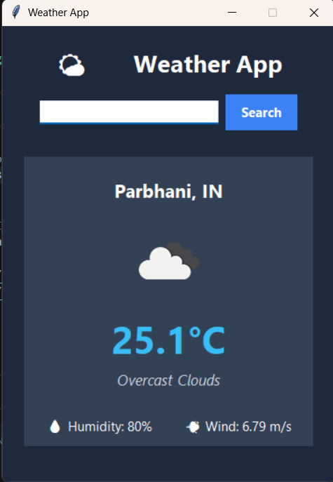

# Python Weather App

# Python Weather App (Tkinter + OpenWeatherMap)

A simple desktop GUI app that fetches real-time weather for any city using the
OpenWeatherMap API.

---

## 1. Prerequisites & Installation

You need **Python 3.8+**. Tkinter ships with standard Python installs on
Windows/Mac. On some Linux distros you may need to install it separately.

Install the required libraries:

```bash
pip install requests pillow
```

If Tkinter is missing on Linux (Debian/Ubuntu):

```bash
sudo apt-get install python3-tk
```

That's it — `tkinter` and `io`, `os` are part of Python's standard library,
so nothing else needs to be installed for them.

---

## 2. Getting a Free OpenWeatherMap API Key

1. Go to **https://openweathermap.org/**
2. Click **"Sign Up"** (top right) and create a free account (email + password).
3. Verify your email address (check your inbox for a confirmation link).
4. Log in, then click your username (top right) → **"My API keys"**.
   - Direct link once logged in: https://home.openweathermap.org/api_keys
5. You'll see a **default API key** already generated for you. Copy it.
   (You can also click "Generate" to create a new named key.)
6. ⚠️ **Important:** A brand-new API key can take **up to 2 hours** to activate.
   If you get an "Invalid API key" (401) error right after signing up, wait
   a bit and try again.

### Adding the key to the app

You have two options — pick whichever is easier for you as a beginner:

**Option A — quick & simple (paste directly into the code):**
Open `weather_app.py` and replace this line:
```python
API_KEY = "PASTE_YOUR_API_KEY_HERE"
```
with your actual key, e.g.:
```python
API_KEY = "a1b2c3d4e5f6g7h8i9j0"
```

**Option B — safer (environment variable, recommended once you're comfortable):**
Instead of editing the code, set an environment variable before running the app.

- Windows (PowerShell):
  ```powershell
  $env:OPENWEATHER_API_KEY="your_key_here"
  python weather_app.py
  ```
- Mac/Linux (bash):
  ```bash
  export OPENWEATHER_API_KEY="your_key_here"
  python3 weather_app.py
  ```

This keeps your key out of the source code — good practice if you ever push
this project to GitHub.

---

## 3. Running the App

```bash
python weather_app.py
```

Type a city name (e.g. `Pune`, `London`, `Tokyo`) and hit **Enter** or click
**Search**.

---

## 4. Features

- 🔍 Search weather by city name
- 🌡️ Current temperature in Celsius
- 🌡️ Feels like temperature
- 💧 Humidity percentage
- 💨 Wind speed (m/s)
- 🖼️ Live weather condition icon (sun, clouds, rain, etc.)
- 📝 Weather description (e.g. "Light Rain", "Clear Sky")
- ⚠️ Error handling for:
  - City not found (404)
  - Invalid/inactive API key (401)
  - No internet connection
  - Request timeout
  - Unexpected/malformed API responses

## 📸 Screenshot


---

## 5. Possible Extensions (good next steps for learning)

- Add a **5-day forecast** using the `/forecast` endpoint.
- Add **unit toggle** (°C / °F).
- Add **"use my location"** via IP-based geolocation.
- Cache last-searched city so it loads automatically on startup.
- Package it as a `.exe` using `pyinstaller` to share with friends.
